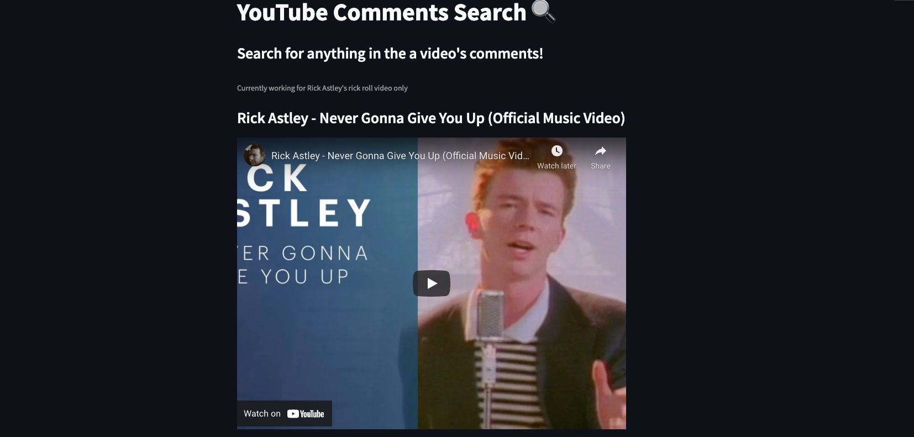
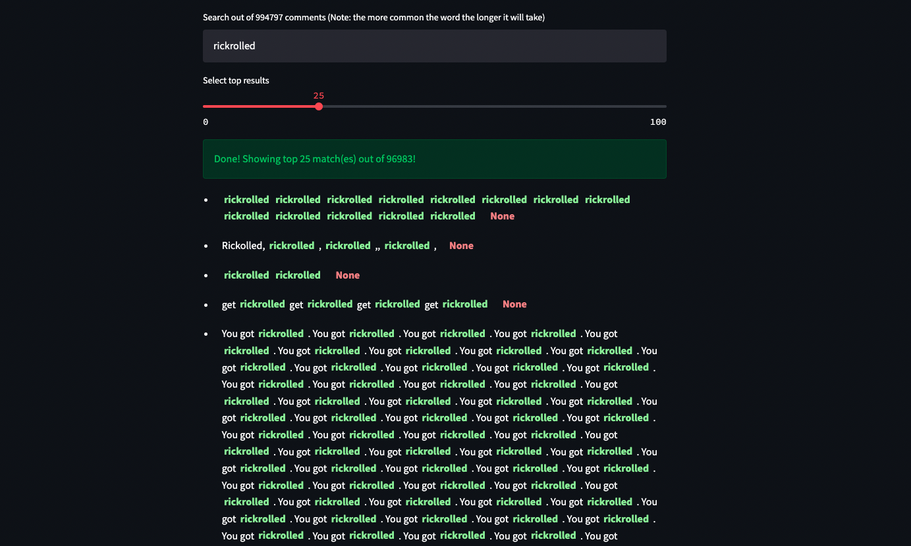
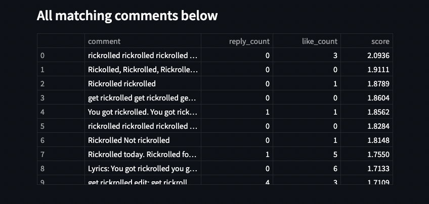

# Youtube Comments Sentiment Analysis

This is a streamlit app that allows users to search through the "Never Gonna Give You Up" music video by Rick Astley, or better known as the rickroll video.

## About

The main idea of the app is a filter feature for YouTube video comments. I sometimes do `CMD + F` and look for particular comments and I thought it would be fun to make an app that filters out only comments I'm interested in.

In my app, any user can search for comments in the popular rick roll video – Rick Astley's Never Gonna Give You Up. There was restrictions in getting all the comment data however, due to the API quota restrictions. There's also the fact that there are new comments to the video every single day (2,047,723 comments as of the day this article is published)

Nonetheless, I was only able to get ~1 million comments, which I believe is more than enough for this little side project.

To build the web app, I used streamlit because it's easy to use and is great out-of-the-box. It has well designed components and I don't have to worry about web dev.

To build the search functionality, I used MongoDB Atlas Search, which was great and simple to set up. I loved the fact that I could test my search index before writing any code. The searches are ranked by the search score of Atlas search by default, so users are getting results that are accurate and matches the query.

To allow anyone to search over 1m comments for the rickroll video, the app is hosted on Streamlit Cloud. [Try it out!](https://share.streamlit.io/benthecoder/yt-comments-mongodb-search/main/yt_comments/app.py)

This project was inspired by the [MongoDB Atlas Hackathon on DEV](https://dev.to/devteam/announcing-the-mongodb-atlas-hackathon-on-dev-4b6m)

## Images of the app

 

## Guide to YouTube API

Here's a guide to get your YouTube API key

- https://blog.hubspot.com/website/how-to-get-youtube-api-key

Check your YouTube API quota

- https://console.cloud.google.com/iam-admin/quotas

## Acknowledgement

- [How to Build Your Own Dataset of YouTube Comments | by William Yang | Towards Data Science](https://towardsdatascience.com/how-to-build-your-own-dataset-of-youtube-comments-39a1e57aade)
